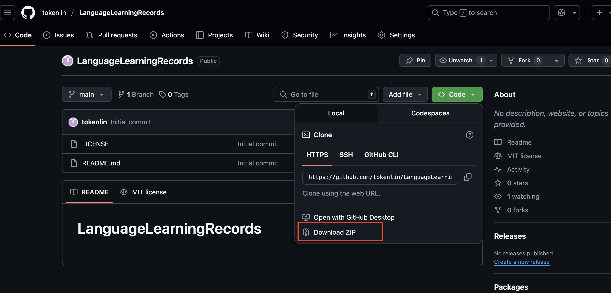
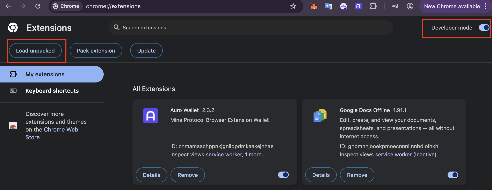
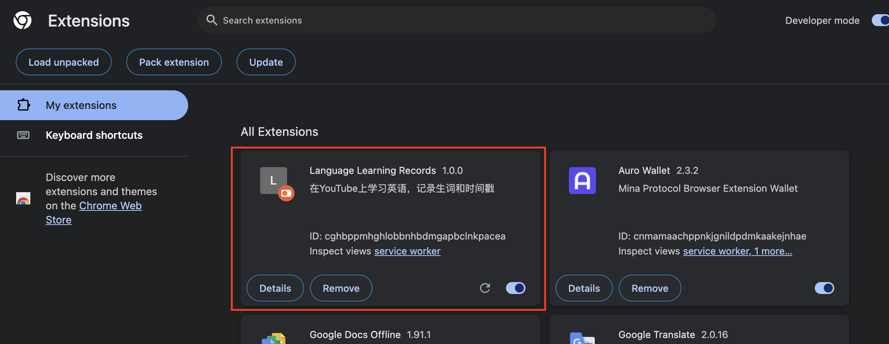
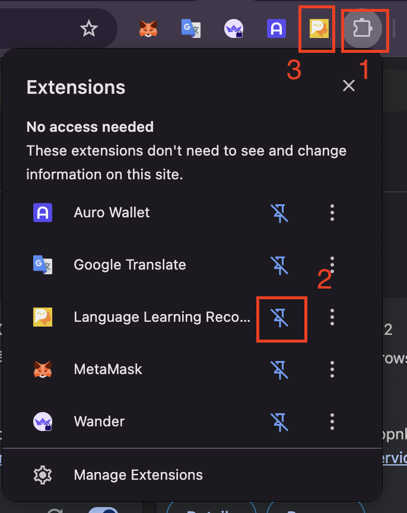
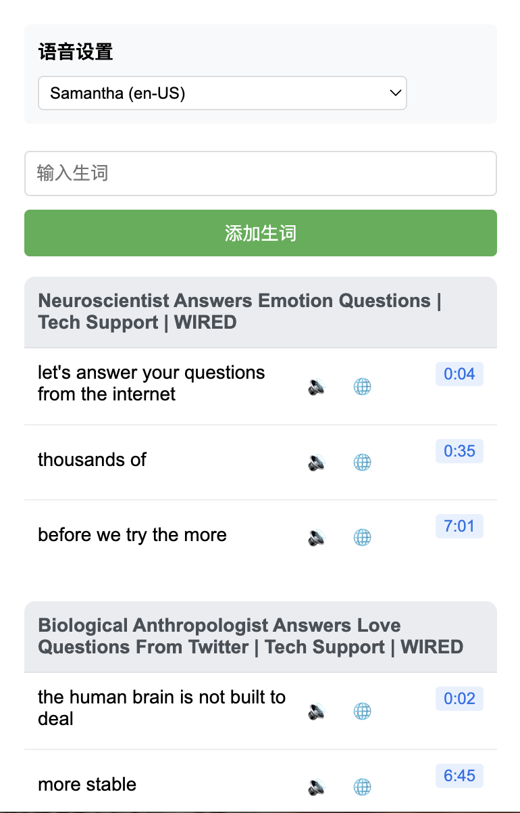

# LanguageLearningRecords 介绍

英语正常交流能力已成为很多人走向国际化最大的障碍。特别是听力，其能力不足将直接无法进行交流。

因此本插件从提高英语听力这个最基本最重要的方向作为出发点，在youtube进行大量视频听力训练，并记录在听力过程中遇到生词，不断增加英语词汇量，达到听力词汇量的双重效果。


# LanguageLearningRecords 特点

- 在观看英语视频过程中，遇到生词，可以随时记录，同时视频的时间戳也记录，方便回放。

- 每个视频的记录均汇总在一起，按照时间戳排序。
- 每条记录均可以单独发音，翻译。同时视频回放可以定位到当时记录生词的位置，极大加深用户的词汇量。
- 记录的生词熟悉后可以手动删除。
- 后期可以增加钱包功能，可以上链记录，极大方便跨区域学习。


# 使用方法

1. 进入
[https://github.com/tokenlin/LanguageLearningRecords](https://github.com/tokenlin/LanguageLearningRecords)

2. 克隆到本地
```
git clone https://github.com/tokenlin/LanguageLearningRecords.git
```

3. 对git命令不熟悉的，可以按照下图纸直接下载压缩包到本地，然后在解压出文件夹`LanguageLearningRecords`


4. 打开chrome浏览器，输入`chrome://extensions/`，并打开最右边的开发者模式，然后点击左边的加载按钮，选择刚刚下载的解压出的文件夹`LanguageLearningRecords`，加载后将显示插件。



5. 在浏览器右边栏，点击插件按钮`1`，在弹出的框中点击刚加载的插件的显示按钮`2`,则插件将挂在浏览器工具栏上`3`


6. 点击插件后，即可进行愉快的学习了。
